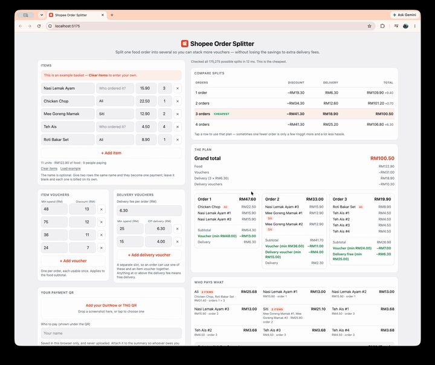

# Shopee Order Splitter

Shopee vouchers have minimum spends, so one big food order usually only gets to
use one. Splitting it into several orders lets you stack more — but each order
pays its own delivery fee, and past a point the fees cost more than the vouchers
save. This finds where that line falls, and what everyone owes you.

Runs entirely in your browser. No account, nothing uploaded.



## Quick start

```bash
npm install
npm run dev     # http://localhost:5173
```

## How to use it

- **Add your items** — price is the only field that matters. Put the same name
  on two rows and they become one payment; leave it blank and each is billed on
  its own.
- **Add your vouchers** — a minimum spend and an amount off. Delivery vouchers
  go in their own slot, so one order can use both at once.
- **Read the plan** — grand total first, then each order and who owes what.
- **Compare splits** — tap any row in the table to switch to that plan. One
  fewer order is often a couple of ringgit more and a lot less hassle.
- **Watch for "So close"** — an order a ringgit short of a voucher you hold.
  Moving one item can pay for itself.
- **Add your payment QR** — drop in a screenshot, crop to the QR square, and
  *Share summary + QR* sends one image to the group chat that everyone can
  scan and pay from.

Your basket, vouchers and QR are remembered on this device. The first visit
shows a labelled example — **Clear items** wipes it and keeps your vouchers.

## Things worth knowing

- **Rows with no price are ignored** — they are almost always an empty row, and
  counting one as a person who owes nothing distorts the head count.
- **Shares add up exactly.** The last person absorbs the rounding remainder,
  unless that would take them below zero, in which case the biggest payer does.
- **Units move between orders individually.** That is what makes vouchers stack,
  so one person's items can land in different orders while they owe one amount.
- **`dist/` must be served**, not opened from disk — module scripts are
  CORS-blocked on `file://`. Use `npm run preview`.

## Privacy

No server. Your basket and QR live in your browser's local storage and are never
sent anywhere. The share image is built on your device.

## Development

```bash
npm test          # 137 tests
npm run lint
npm run build     # -> dist/
npm run preview
```

**[How it works →](docs/how-it-works.md)** — the search, the layout, the styling.
